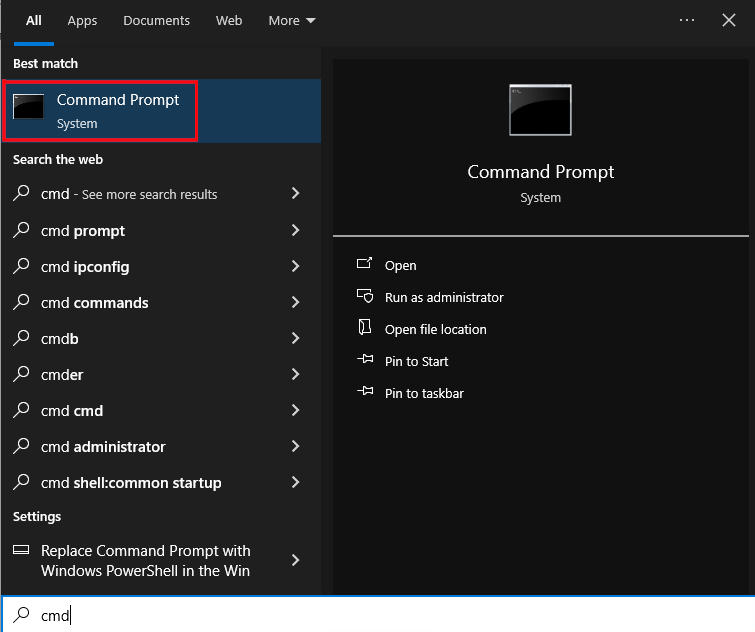

# Team 5: Team 5 Green Team Documentation

This document is intended to be used by the green team for using our (Team 5's) services.

## Using the File Service Over SSH

### If You're on Linux...

Firstly, open a terminal.


Next, type the following:

```sh
ssh {your user name}@files.team5.isucdc.com
```

> Replace `{your user name}` with your username.  
> Press enter once the command looks good.

Next, type in your password.

> NOTE: your password will be invisible as you type it, but rest assured, it is being received.

You are now logged in.

### If You're on Windows...

> We will use the ssh client PuTTY as an example of how to access this service.
> There are many other ssh clients available for windows, but the process is very much the same.
> 
> We will begin assuming that PuTTY is open.

First, put `files.team5.isucdc.com` in the ___ box.

>> Next documenter: please note and screenshot the buttons to press
>> also, please take many screenshots.

TODO: Image.png

-Tell how to enter username and password.

TODO: Image.png

-Tell that they are in

### Now That You've Logged in

Your files are now available for your perusal through the command line.
You have the ability to execute basic commands like `ls`, `mv`, `rm`, `cp`, etc.
You also have the ability to run the editors `nano`, `vim` and `emacs`.

### Using the File Service as an Admin over SSH

Firstly, follow the instructions above ([Using the File Service](#using-the-file-service)) to log in.

Everything will be the same until you need to run a privileged command.

Let's use the example of updating the system using `dnf`.

To do this you will run:

```sh
sudo dnf upgrade
```
Then enter your password when prompted.

> Note: Like when you log in over ssh, your password will be invisible as you type it, but rest assured, it is being received.

## Accessing the Website

Open your web browser and go to the following website:

```
www.team5.isucdc.com
```

You should get a site that looks like this one:


### Adding yourself to the mailing list

First, go to the website. This is explained directly above this section.

Next, click the button labeled `ENEWS` on the green ribbon.


Next, enter your email in the box below the text `Enter email to sign up for eNews`.


Finally, click the `SEND` button.


## Using the Windows Client

TODO: EXAMPLE OF AN RDP CLIENT

-The user enters their info.

-The user is on teh windowes client.

### Using RDP


### Accessing Your Files From the Windows Client

Now that you are on the machine, open the start menu.


Next, type `CMD` into the start menu.


Select Command Prompt.




A friendly text window should pop up.

In this window type the following:

```bat
net use Z: \\files.team5.isucdc.com\homes /user:{username}
```

> Replace `{username}` with your username.

Press enter once what you typed looks good.

When prompted, enter your password.

> Note: Your password will be invisible as you type it, but rest assured, it is being received.

Your files are now mounted as the `Z:` drive and can be interacted with however you please.

Remember to log off of the windows client when you are done, to ensure that no one can maliciously modify your files.

## Using the Linux Client

TODO: COPY FROM [THIS](#using-the-file-service-over-ssh)
