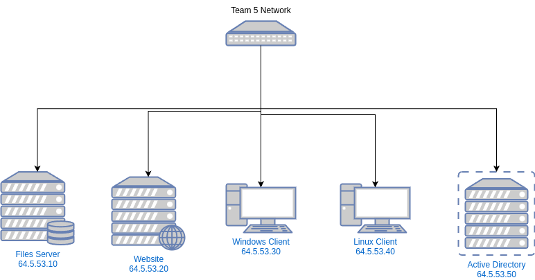

# Team 5: Team 5 White Team Documentation

### Publicly Available Services

| Domain Name            | IP         | Ports       |
| ---------------------- | ---------- | ----------- |
| files.team5.isucdc.com | 64.5.53.10 | 22,445      |
| www.team5.isucdc.com   | 64.5.53.20 | 22,3000     |
| wc.team5.isucdc.com    | 64.5.53.30 | 3389        |
| lc.team5.isucdc.com    | 64.5.53.40 | 22          |
| ad.team5.isucdc.com    | 64.5.53.50 | 3389        |

## Servers
### Overall

All servers have been audited and scanned using 'Nessus', 'nuclei', 'nmap'.
#### Operating System Information

Our file server is running a Red Hat-based distribution called Alma Linux (v8.9).
Our web server is running Ubuntu 22.04.
The Windows Client is running Windows 10.
The Linux Client is running Ubuntu 22.04.
The Active Directory server is running Windows Server 2016.

#### Firewall Rules:
 
**All Servers**: Incoming connections on all devices are only allowed to machines on the 64.5.53.0/24 subnet.  
**File Server**: Inbound connections not on the 64.5.53.0/24 are allowed on ports 22 (ssh) and 445 (smb).  
**Web Server**: Inbound connections not on the 64.5.53.0/24 are allowed on ports 22 (ssh) and 3000 (http(s)).  
**WC Server**: Inbound connections not on the 64.5.53.0/24 are allowed on port 3389 (rdp).  
**LC Server**: Inbound connections not on the 64.5.53.0/24 are allowed on port 22 (ssh) and 445 (smb).  
**AD Server**: Inbound connections not on the 64.5.53.0/24 are allowed on port 3389 (rdp).  

#### Applications
**Samba**: Samba is running on port 445 on the files server to provide Windows and Linux compatable secure file sharing capabilities.  
**Website**: A "Next.js" application in combination with a backend http-python script on the www server hosts the school's web page and processes frontend requests. A regex check has been added to the http-python script to validate user input.

#### Fixes

**All Servers**

* Linked linux boxes to the domain by applying additonal configuration to the `sssd` service
* `ssh` was autoclosing connections upon successful connect, we diegnosed the issue then applied nescacary config
* Changed default password for all accounts
* Restricted ALL ports except stricly nescacary funtionality ports to the local subnet
* Restrict access to sudo and su for students and teachers

**Web Server** 

* The website and `python-http` script were given their own service accounts.
* The python server for handling emails was fixed to validate emails and prevent injection.
* Added a timestamp to the python POST server for intrusion reports.
* Removed unessecary user called "cdc"
* Changed SSH to only allow password authentication
* Fixed alias for `ls` being `abcdefghijklmnopqrstuvwxyz`
* Removed the `telnetd` python script. This was not a telnet server, but instead was a python script that used non encrypted channels to send back whatever command it received.

**File Server**

* Did not upgrade to AlmaLinux 9
* Installed all editors on the server
* Reconfigured `/etc/exports` to restrict samba to the users home directories.
* Removed backdoor users, `backdoor:backdoor` and `taco`
* Investigated cron jobs
* Ran updates with dnf

  **AD Server**
  
  * Placed flags
  * Removed insecure users from the Administrators AD group
  * Properly configured RDP
 
  **WC Server**

  * Removed local user "scrat" distint from user on AD
  * Configured RDP
  * Ensured connectivity to ALL servers from WC

 **LC Server**

 * Removed "doug" user
 * Investigated `/etc/totallyNotAnnoyingScripts`, then removed them.
 * Investigated Cron jobs, and removed a job that would ensure global access to `/etc/passwd` and `/etc/shadow`
